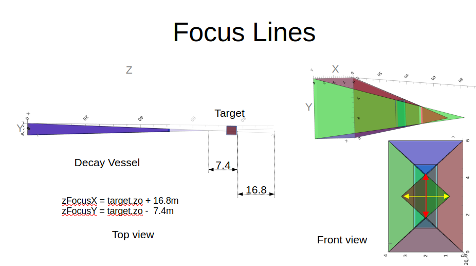

# Documentation: Veto ( Decay Vessel + Integrated SBT )

## Introduction
lorem ipsum

## Plots and Results
Test plots here:

### Plot 1: Description of Focus Line for the geometry:

### Dummy Table:
Ignore tha values.
| Data type | nEvents with no SBT activity | nEevents with SBT activity | Total number of events |
| :- | -: | :-: | :-: |
|Muon DIS |339|18102|18441|
|Neu DIS |856|17760|18616|
|Signal + EMBG |9567|30433|40000|
|**Combined** | 10762| 66295| 77057|
